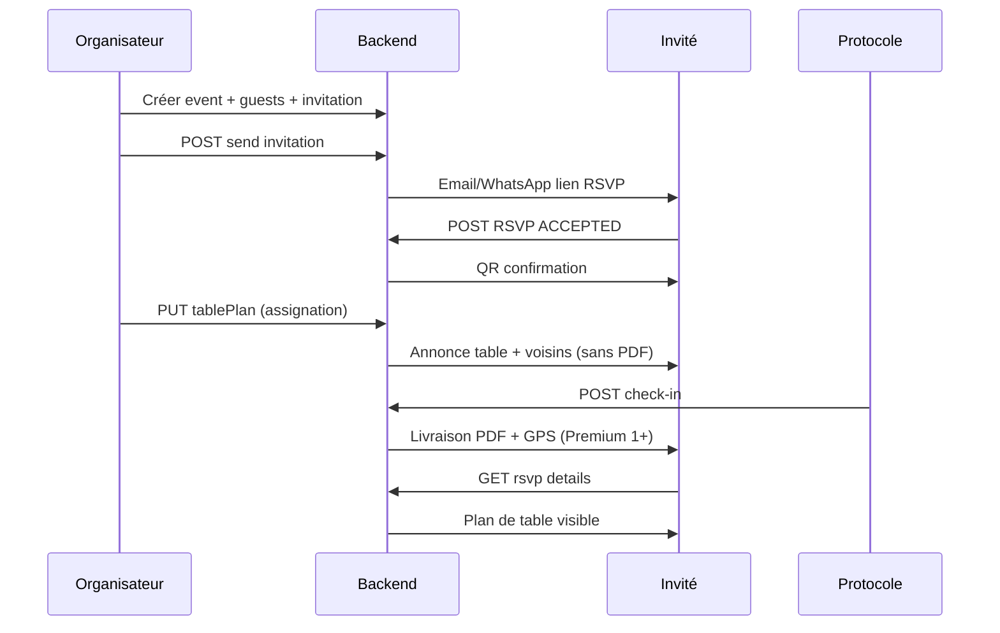

# EventMaster — Analyse des flux implémentés

> **Version** : juillet 2026  
> **Public** : équipe produit, développeurs, partenaires  
> **Monorepo** : `backend/` · `frontend/` · `mobile/`

📄 **Version PDF designée** : [`EventMaster-Analyse-Flux.pdf`](./EventMaster-Analyse-Flux.pdf)

```bash
cd backend && npm run generate:flows-pdf
```

---

## 1. Architecture globale

EventMaster est un monorepo **SaaS multi-tenant** en trois entités :

| Entité | Stack | Port dev | Rôle |
|--------|-------|----------|------|
| `backend/` | Node.js, Express, Prisma, PostgreSQL | 5001 | API REST, notifications, PDF, workers |
| `frontend/` | Next.js (App Router), Tailwind | 3000 | Dashboard organisateur, portail RSVP, protocole web |
| `mobile/` | React Native, Expo SDK 57 | 8081 | RSVP invité, protocole natif, consultation |

**Isolation** : chaque `Tenant` (organisation) est cloisonné ; toutes les requêtes filtrent par `tenantId`.

**Workers** :
- `reminderService.ts` — rappels RSVP automatiques
- `subscriptionExpiryService.ts` — alerte et désactivation licence

---

## 2. Flux authentification & multi-tenant

### Parcours

```
Inscription → Tenant (FREE) + User owner → OTP email/WhatsApp → JWT 24h → Dashboard
```

### Points d'entrée

| Action | API | Fichier |
|--------|-----|---------|
| Register | `POST /api/auth/register` | `authController.ts` |
| OTP | `POST /api/auth/verify-otp` | `otpService.ts` |
| Login | `POST /api/auth/login` | `authController.ts` |
| Profil | `GET /api/auth/profile` | `permissionsService.ts` |

### Règles métier

- Transaction atomique : création organisation + propriétaire
- JWT : `userId`, `tenantId`, `role` (`SUPER_ADMIN` | `COMMERCIAL` | `USER`)
- Licence : `requireActiveLicense` bloque l'accès si `licenseActive=false` ou date expirée
- Parrainage : `referralCode` → commercial plateforme ou commercial org

### RBAC organisation

| Rôle | Périmètre | Créer événement |
|------|-----------|-----------------|
| Propriétaire / Manager | Toute l'org | Oui |
| Protocole org. | Invités (tous événements) | Non |
| Manager salle | Événements de la salle | Non |
| Protocole événement | Invités de l'événement | Non |
| Commercial org. | Organisations parrainées | N/A |

Fichier central : `backend/src/services/permissionsService.ts`

---

## 3. Cycle événement → invitation → RSVP

### Phase organisateur (web)

1. Créer événement (quota `maxEvents`)
2. Ajouter invités (unitaire ou CSV)
3. Concevoir modèle visuel (`dashboard/templates/`)
4. Créer invitation et diffuser (`invitationController.ts`)

**Envoi initial** : lien RSVP uniquement — **pas de PDF, pas de GPS WhatsApp**.

### Phase invité (portail public)

| Étape | Route | Comportement |
|-------|-------|--------------|
| Consultation | `GET /api/rsvp/:guestId` | Template + événement ; GPS/plan masqués si non validé |
| Réponse | `POST /api/rsvp/:guestId` | ACCEPTED / DECLINED + préférences |
| Après acceptation | — | QR code envoyé (email + WhatsApp image) |
| Organisateur | — | Notifié à chaque changement RSVP |

**Verrouillage** : RSVP impossible après la date de l'événement.

Écrans : `frontend/src/app/rsvp/[guestId]/page.tsx`, `mobile/app/rsvp/[guestId].tsx`

---

## 4. Flux plan de table — double notification

Flux métier central d'EventMaster : **deux livraisons distinctes**.

### Schéma

```
Invitation RSVP          Assignation table           Check-in protocole
     │                         │                            │
     ▼                         ▼                            ▼
 Lien seul              Annonce (table + voisins)    Livraison complète
                        SANS PDF / SANS GPS          PDF + plan + GPS WA
```

### A. Annonce à l'assignation

| | |
|---|---|
| **Déclencheur** | `PUT /api/events/:id` avec `tablePlan` modifié |
| **Service** | `tableAssignmentNotificationService.ts` |
| **Mode** | `delivery: 'announcement'` dans `guestSeatNotificationService.ts` |
| **Contenu** | Table, siège n°, voisins de table, lien RSVP |
| **Exclu** | PDF, localisation GPS WhatsApp |
| **Forfait** | Tous forfaits **payants** (≠ FREE) |
| **Détection** | `findAssignmentChanges()` — nouvel assigné ou déplacement |

### B. Livraison complète post check-in

| | |
|---|---|
| **Déclencheur** | `check-in` ou `verify-seat` (match) |
| **Service** | `guestPlacementDeliveryService.ts` |
| **Mode** | `delivery: 'full'` (défaut) |
| **Contenu** | PDF Cloudinary, email + WA document, pin GPS |
| **Forfait** | **Premium 1+** (`seatNotifications: true`) |
| **Conditions** | `checkedInAt` ou `seatVerified` ; siège assigné ; pas déjà envoyé (`placementNotifiedAt`) |
| **Portail** | Plan interactif, carte GPS, PDF téléchargeable |

### Matrice d'accès invité

| Donnée | Invitation | Après assignation | Après check-in |
|--------|------------|-------------------|----------------|
| Lien RSVP | ✅ | ✅ | ✅ |
| Notif table + voisins | ❌ | ✅ (email/WA) | — |
| Plan portail | ❌ | ❌ | ✅ |
| PDF placement | ❌ | ❌ | ✅ (Premium 1+) |
| GPS WhatsApp | ❌ | ❌ | ✅ (Premium 1+) |
| Carte web | Lieu texte | Lieu texte | Carte complète |

Fichier règle : `backend/src/utils/guestPlacementAccess.ts` → `canGuestAccessPlacement()`

### PDF d'invitation placement

- **Principal** : Puppeteer → `/rsvp/:guestId/print` → `GuestInvitationPrintDocument.tsx` (modèle visuel + QR + plan)
- **Secours** : PDFKit redesigné → `invitationPdfService.ts`
- **Print API** : `?print=1` sur GET RSVP pour inclure plan sans check-in (génération PDF uniquement)

---

## 5. Flux protocole QR

### Endpoints

Préfixe : `/api/events/:eventId/...` — `protocolController.ts`

| Endpoint | Action |
|----------|--------|
| `GET .../protocol/guests` | Liste invités + sièges |
| `POST .../protocol/scan` | Parse QR / URL / UUID |
| `POST .../guests/:id/check-in` | Confirmation présence |
| `POST .../guests/:id/verify-seat` | Validation siège vs plan |
| `GET/POST .../protocol-notes` | Notes protocole |

### Règles

- Forfait **Business+** (`protocolQr: true`)
- Check-in refusé si `rsvp !== 'ACCEPTED'`
- Verify-seat match → déclenche livraison complète (si Premium 1+)

### UI

| Plateforme | Fichier |
|------------|---------|
| Web | `GuestProtocolPanel.tsx`, `QrCameraScanner.tsx` |
| Mobile | `mobile/app/(app)/protocol/[eventId].tsx`, `QrScanner.tsx` |

---

## 6. Facturation & commercial

### Tenant

- Quotas temps réel (`planFeaturesService.ts`)
- Demande upgrade → approbation admin → facture PDF
- Stripe checkout + webhook ; mode mock en dev

### Commercial plateforme

- Code parrainage → création org client
- Commission **20 %** mensuelle (`CommercialCommission`)

### Commercial organisation

- Forfait **Enterprise 2+**
- Parrainage interne (`referredByOrgUserId`)

Config forfaits : `backend/src/config/plansConfig.ts`

| Plan | Protocole QR | Notifications placement |
|------|--------------|-------------------------|
| Essentials (FREE) | ❌ | ❌ |
| Business (STANDARD) | ✅ | ❌ (annonce table uniquement) |
| Premium 1+ | ✅ | ✅ |
| Enterprise | ✅ | ✅ |

---

## 7. Application mobile

### Implémenté

| Flow | Route / API |
|------|-------------|
| Auth JWT + OTP | `(auth)/login`, `verify-otp` |
| Événements | `(tabs)/events`, `events/[id]` |
| Protocole QR | `protocol/[eventId]` |
| RSVP invité public | `rsvp/[guestId]` |
| Push Expo | `POST /notifications/push-token` |
| Deep links | `eventmaster://rsvp/:id`, `event/:id`, `protocol/:eventId` |

### Hors scope mobile (web uniquement)

Édition modèles, plan de table drag-and-drop, diffusion invitations, facturation.

---

## 8. Parcours invité complet (séquence)



---

## 9. Fichiers pivots

| Domaine | Chemin |
|---------|--------|
| Schéma BDD | `backend/prisma/schema.prisma` |
| Auth + licence | `backend/src/middleware/auth.ts` |
| Permissions | `backend/src/services/permissionsService.ts` |
| RSVP public | `backend/src/controllers/rsvpController.ts` |
| Annonce assignation | `backend/src/services/tableAssignmentNotificationService.ts` |
| Livraison post check-in | `backend/src/services/guestPlacementDeliveryService.ts` |
| Notifications placement | `backend/src/services/guestSeatNotificationService.ts` |
| Accès placement | `backend/src/utils/guestPlacementAccess.ts` |
| Protocole | `backend/src/controllers/protocolController.ts` |
| Forfaits | `backend/src/config/plansConfig.ts` |
| Hub événements web | `frontend/src/app/dashboard/events/page.tsx` |
| PDF invitation print | `frontend/src/components/GuestInvitationPrintDocument.tsx` |
| Protocole mobile | `mobile/app/(app)/protocol/[eventId].tsx` |

---

## 10. Points d'attention

1. **Business** : protocole QR oui, livraison PDF/GPS post check-in non (Premium 1+ requis).
2. **Annonce assignation** : active dès le premier forfait payant.
3. **PDF Cloudinary** : URL stockée ; régénération au prochain check-in si absente.
4. **Rappels RSVP** : pas de GPS dans les rappels (cohérent avec invitation initiale).

---

*Document généré à partir de l'état du code EventMaster — juillet 2026.*
